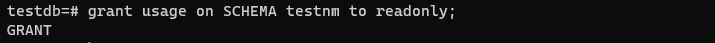

# Домашнее задание №4

Описание/Пошаговая инструкция выполнения домашнего задания:

* 1 Создайте новый кластер PostgresSQL 14
  > 
* 2 Зайдите в созданный кластер под пользователем postgres
sudo -u postgres psql
* 3 Создайте новую базу данных testdb
  > 
* 4 Зайдите в созданную базу данных под пользователем postgres
  > 
* 5 Создайте новую схему testnm
  > 
* 6 Создайте новую таблицу t1 с одной колонкой c1 типа integer
  > 
* 7 Вставьте строку со значением c1=1
  > 
* 8 Создайте новую роль readonly
  > 
* 9 Дайте новой роли право на подключение к базе данных testdb
  > 
* 10 Дайте новой роли право на использование схемы testnm 
  > 
* 11 Дайте новой роли право на select для всех таблиц схемы testnm 
  > 
* 12 Создайте пользователя testread с паролем test123 
  > 
* 13 Дайте роль readonly пользователю testread 
  > 
* 14 Зайдите под пользователем testread в базу данных testdb
  > 
* 15 Сделайте select * from t1;
  > 
* 16 Получилось? (могло если вы делали сами не по шпаргалке и не упустили один существенный момент про который позже)
  __*Не получилось прочитать таблицу t1, нет прав доступа.*__
  > 
* 17 Напишите что именно произошло в тексте домашнего задания
  __*Создали таблицу t1 в базе данных testdb, и у пользователя testread  есть доступ к базе testdb из-за роли readonly. Казалось бы что пользователь testread должен иметь доступ на чтение к ней, а доступа нет.  В задании сказано было создать таблицу t1, но не указали в какой схеме.*__
* 18 У вас есть идеи почему? ведь права то дали?
  __*Потому что права на testnm для роли readonly дали, а права на public для роли readonly не дали. А таблица создана как раз в  схеме public.*__
* 19 Посмотрите на список таблиц
  > 
* 20 Подсказка в шпаргалке под пунктом 20
* 21 А почему так получилось с таблицей (если делали сами и без шпаргалки то может у вас все нормально)
  __*Потому что при создании таблицы t1 не была указана явно схема testnm, в которой создать. Поэтому таблица создалась по умолчанию в схеме public. 
Прав на public для роли readonly не давали.*__
* 22 Вернитесь в базу данных testdb под пользователем postgres
  > 
* 23 Удалите таблицу t1
  > 
* 24 Создайте ее заново но уже с явным указанием имени схемы testnm
  > 
* 25 Вставьте строку со значением c1=1
  > 
* 26 Зайдите под пользователем testread в базу данных testdb
  > 
* 27 Сделайте select * from testnm.t1;
  > 
* 28 Получилось?
  __*Нет, не получилось, нет прав доступа.*__
* 29 Есть идеи почему? если нет - смотрите шпаргалку
  __*Потому что выполненная ранее команда «grant SELECT on all TABLEs in SCHEMA testnm TO readonly;» была актуальна для существующих таблиц на тот момент. 
С момента ее выполнения таблица пересоздавалась, и теперь нужно повторно выполнить команду «grant SELECT on all TABLEs in SCHEMA testnm TO readonly;»*__

  __*Потому что команда «ALTER default…» будет действовать для новых таблиц, а команда «grant SELECT on all TABLEs in SCHEMA testnm TO readonly» отработала только для существующих таблиц на тот момент времени. Нужно выполнить снова  команду «grant SELECT…» или пересоздать таблицу.*__
* 30 Как сделать так чтобы такое больше не повторялось? если нет идей - смотрите шпаргалку
  > 
* 31 Сделайте select * from testnm.t1;
  > 
* 32 Получилось?
  __*Да.*__
  > 
* 33 Ура!
* 34 Теперь попробуйте выполнить команду create table t2(c1 integer); insert into t2 values (2);
  > 
* 35 А как так? нам же никто прав на создание таблиц и insert в них под ролью readonly?
  __*Таблица создалась в схеме public, по умолчанию, так как не указал явно схему при создании таблицы.*__ 
  __*Каждый пользователь может по умолчанию создавать объекты в схеме public в базе данных, если у него есть право на подключение к этой базе данных.
А право на подключение к базе testdb у пользователя testread есть.*__
* 36 Есть идеи как убрать эти права? если нет - смотрите шпаргалку
  __*Нужно отменить права на создание таблиц в схеме public для пользователя testread.*__
* 37 Если вы справились сами то расскажите что сделали и почему, если смотрели шпаргалку - объясните что сделали и почему выполнив указанные в ней команды
  __*Под суперпользователем postgres запретил создавать таблицы в схеме public в базе testdb.*__
  __*Команда «REVOKE CREATE on SCHEMA public FROM public; » отменила права на создание чего либо в схеме public  всем пользователям.*__
  __*Команда « REVOKE ALL on DATABASE testdb FROM public; » отменила всем все права по отношению к базе данных  testdb.*__
  > 
* 38 Теперь попробуйте выполнить команду create table t3(c1 integer); insert into t2 values (2);
  > 
* 39 Расскажите что получилось и почему
  __*Теперь создать таблицу в БД testdb не получилось. Права на создание таблиц в схеме  public отменены.*__ 

